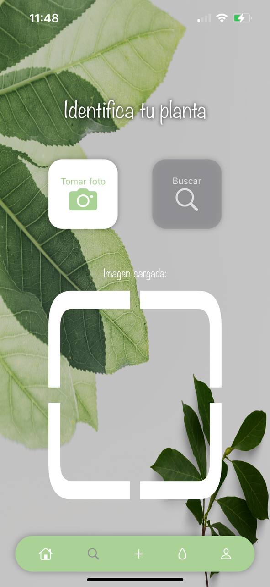
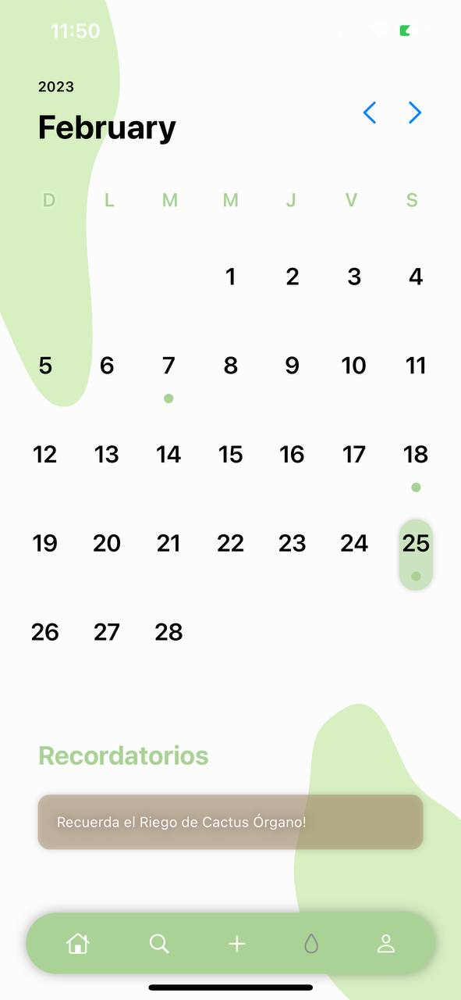

<h1 align="center"> :seedling: Mis Plantas: Aplicacion iOS :seedling:</h1>
<h3 align="center"> :construction: En desarrollo :construction: </h3>

Es un administrador de plantas, crea tu usuario y registra tus habitaciones, en cada una de ellas añade las plantas que tengas, tomales una foto y contesta unas sencillas preguntas para que te recordemos que día regarlas o cuando les toca abono, no sabes su nombre? Toma una foto de ella y te lo diremos.

<h2> Tecnologias  y Herramientas utilizadas </h2>
 

<h3> Inicia sesion o crea una cuenta nueva y visualiza tus habitaciones  </h3>

<h3> Toma una foto y mira los resultados </h3>

<h3> Agrega tu habitacion o planta, automaticamente se añade el recordatorio</h3>

